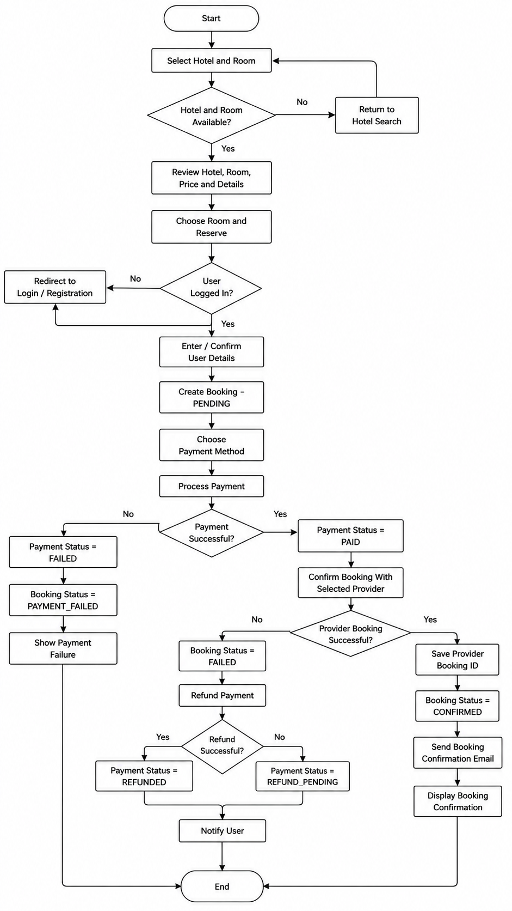
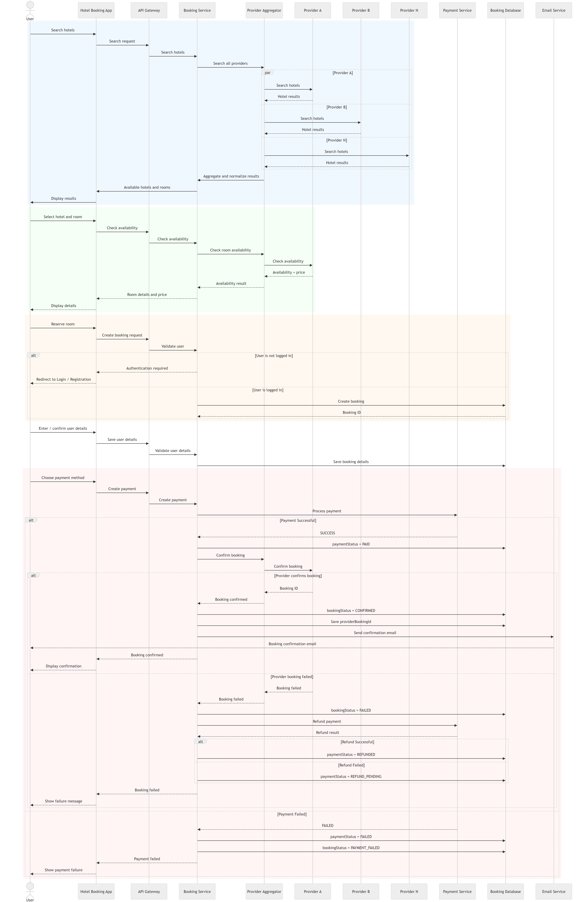
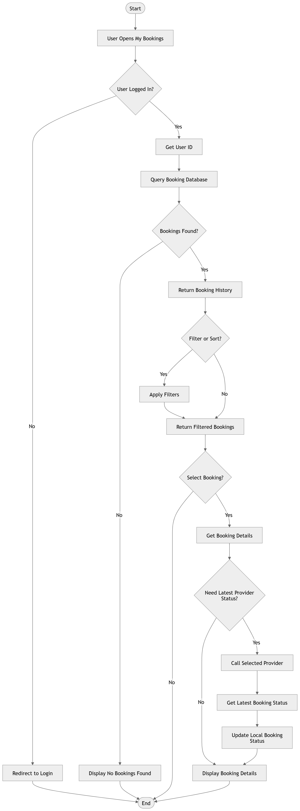
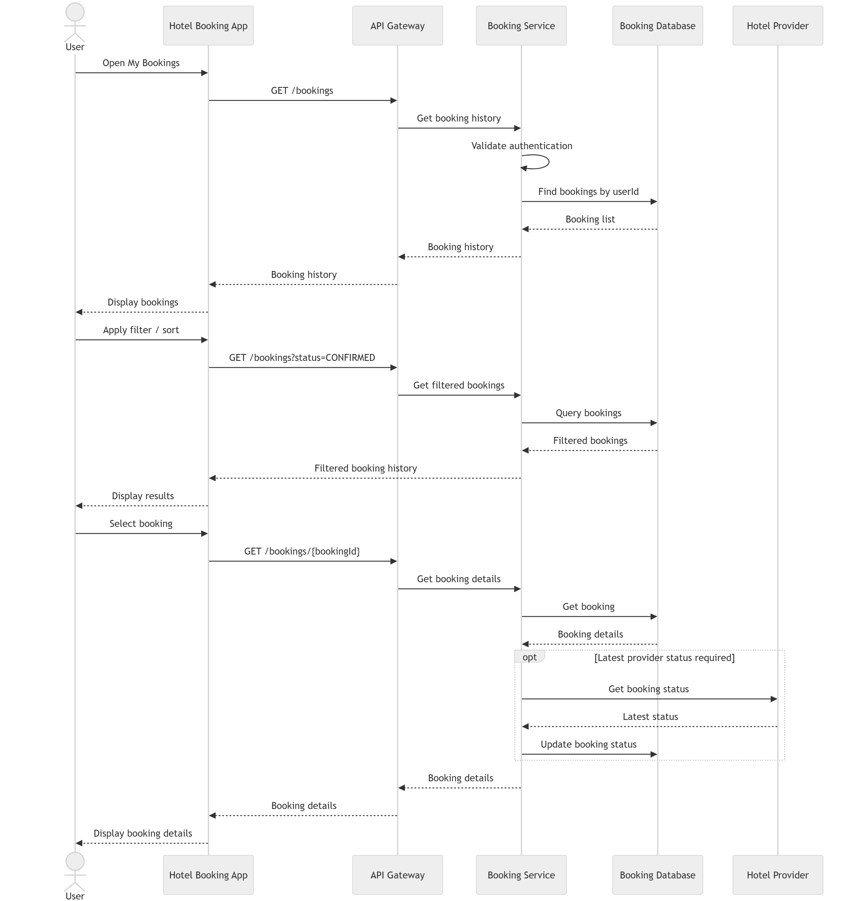
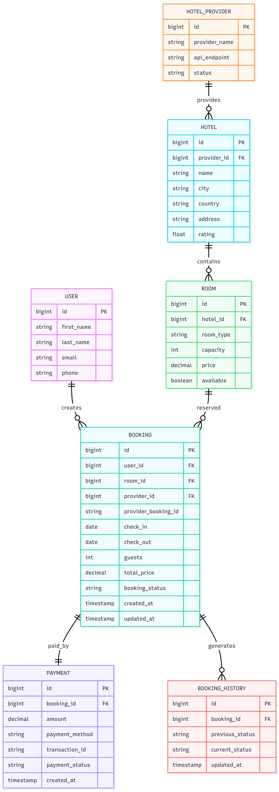

# Hotel Booking Module Analysis

The Hotel Booking module allows registered users to search, compare, and book hotels from multiple external providers through a single application.

Instead of connecting directly to a specific provider, the application uses a **Provider Aggregator** that communicates with multiple hotel providers, collects hotel data, normalizes the responses, and returns a unified result to the user.

The booking process includes:

- Hotel search
- Room availability verification
- User authentication
- Booking creation
- Payment processing
- Booking confirmation
- Email notification

## FlowChart


## Sequence Diagram


## Pseudocode
``` code
FUNCTION bookHotel(userId, hotelId, roomId, bookingDetails):

    ---------------------------------------
    1. Validate User
    ---------------------------------------

    IF userId is NULL:
        RETURN "User must be logged in"

    user = getUser(userId)

    IF user does not exist:
        RETURN "User not found"


    ---------------------------------------
    2. Get Hotel Provider
    ---------------------------------------

    hotel = getHotel(hotelId)

    IF hotel does not exist:
        RETURN "Hotel not found"

    provider = getProvider(hotelProviderId)

    ---------------------------------------
    3. Check Availability
    ---------------------------------------

    availability = provider.checkAvailability(
        hotelId,
        roomId,
        bookingDetails.checkIn,
        bookingDetails.checkOut
    )

    IF availability.available == FALSE:
        RETURN "Room is no longer available"


    ---------------------------------------
    4. Create Pending Booking
    ---------------------------------------

    booking = bookingRepository.create(
        userId = userId,
        hotelId = hotelId,
        roomId = roomId,
        providerId = provider.id,
        price = availability.price,
        status = "PENDING"
    )


    ---------------------------------------
    5. Create Payment
    ---------------------------------------

    payment = paymentService.createPayment(
        bookingId = booking.id,
        amount = availability.price,
        status = "PENDING"
    )


    ---------------------------------------
    6. Process Payment
    ---------------------------------------

    paymentResult = paymentService.processPayment(
        payment.id,
        bookingDetails.paymentMethod
    )


    IF paymentResult.success == FALSE:

        paymentService.updateStatus(
            payment.id,
            "FAILED"
        )

        bookingRepository.updateStatus(
            booking.id,
            "PAYMENT_FAILED"
        )

        RETURN "Payment failed"

    ---------------------------------------
    7. Payment Successful
    ---------------------------------------

    paymentService.updateStatus(
        payment.id,
        "PAID"
    )

    ---------------------------------------
    8. Confirm Booking With Provider
    ---------------------------------------

    providerResult = provider.confirmBooking(
        hotelId,
        roomId,
        bookingDetails
    )


    IF providerResult.success == FALSE:

        bookingRepository.updateStatus(
            booking.id,
            "FAILED"
        )

        refundResult = paymentService.refund(
            payment.id
        )

        IF refundResult.success:

            paymentService.updateStatus(
                payment.id,
                "REFUNDED"
            )

        ELSE:

            paymentService.updateStatus(
                payment.id,
                "REFUND_PENDING"
            )

        RETURN "Booking failed"


    ---------------------------------------
    9. Booking Confirmed
    ---------------------------------------

    bookingRepository.update(
        booking.id,
        status = "CONFIRMED",
        providerBookingId =
            providerResult.bookingId
    )


    ---------------------------------------
    10. Send Confirmation Email
    ---------------------------------------

    emailService.sendBookingConfirmation(
        user.email,
        booking
    )


    ---------------------------------------
    11. Return Result
    ---------------------------------------

    RETURN {
        bookingId: booking.id,
        providerBookingId:
            providerResult.bookingId,
        bookingStatus: "CONFIRMED",
        paymentStatus: "PAID"
    }

END FUNCTION
```

# Booking History
The Booking History module allows users to retrieve all previous bookings stored in the local database. Users can filter their bookings, view booking details, and optionally retrieve the latest booking status from the external provider.

## Flowchart


## Sequence Diagram


## Pseduocode
```code
FUNCTION getBookingHistory(userId, filters):

    ---------------------------------------
    1. Validate User
    ---------------------------------------

    IF userId is NULL:
        RETURN "Unauthorized"

    user = userService.getUser(userId)

    IF user does not exist:
        RETURN "User not found"


    ---------------------------------------
    2. Get Bookings
    ---------------------------------------

    bookings = bookingRepository.findByUserId(
        userId,
        filters
    )


    ---------------------------------------
    3. Check Result
    ---------------------------------------

    IF bookings is empty:
        RETURN "No booking history found"


    ---------------------------------------
    4. Build Response
    ---------------------------------------

    history = []

    FOR EACH booking IN bookings:

        bookingData = {
            bookingId: booking.id,
            hotelName: booking.hotelName,
            room: booking.room,
            checkIn: booking.checkIn,
            checkOut: booking.checkOut,
            price: booking.price,
            bookingStatus: booking.status,
            paymentStatus: booking.paymentStatus,
            provider: booking.provider
        }

        history.add(bookingData)

    RETURN history
```

## Sequence Diagram


END FUNCTION
```


